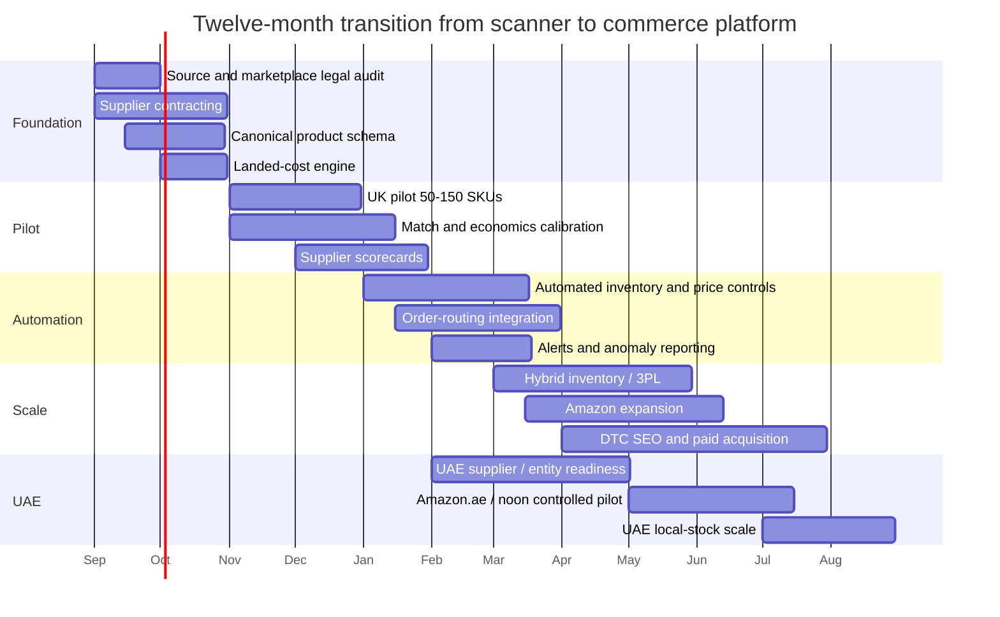

# From Arbitrage Scanner to Compliant Ecommerce Operating System

> **Status:** strategy of record for the `ecommerce_os/` package.
> **Sources and verification:** the regulatory, tax and marketplace-policy
> statements below were gathered in a research pass and are reproduced here as
> the reasoning behind the design. They are *not* legal or tax advice, they
> carry no effective date, and marketplace policies and VAT thresholds change.
> Verify every one against the primary source — and against counsel — before it
> drives a production decision. The engineering thresholds are labelled as
> proposed pilot policy wherever they appear; none of them are marketplace
> rules.

## Executive summary and strategic thesis

A web-scraping-driven arbitrage scanner can become a durable ecommerce
business, but the transition requires a fundamental change in what the software
optimises for.

**Do not optimise for "retailer A is cheaper than marketplace B." Optimise for
"a supply relationship I am contractually entitled to use can reliably generate
positive contribution margin through a channel on which that fulfilment method
is permitted."**

That distinction matters because the simplest retail-arbitrage
implementation — list an item, wait for an order, buy it from another retailer
and enter the buyer's delivery address — is explicitly prohibited by eBay. eBay
permits dropshipping from wholesale suppliers, and its guidance says you should
either own the inventory before listing or have an agreement with a wholesale
supplier covering the items you sell. Amazon likewise permits third-party
fulfilment only when you remain clearly the seller of record, your supplier
relationship supports that arrangement, third-party seller identities do not
appear on packing material, and you remain responsible for returns.

The recommended end state is therefore not a "dropshipping bot". It is a
**product-intelligence and supply-allocation engine** with four progressively
stronger fulfilment paths:

1. authorised supplier-direct dropship for experimentation and long-tail SKUs;
2. small local inventory for products whose demand has been validated;
3. marketplace fulfilment or a 3PL for higher-volume lines;
4. direct manufacturer/distributor relationships and, eventually, exclusivity,
   bundles or private-label derivatives where the data reveals persistent
   demand.

The scanner remains highly valuable. Its role simply changes from automatically
exploiting visible price differences to discovering **commercially executable
supply-demand anomalies**.

```
Scanner → Validated opportunity → Authorised supply → Compliant listing
        → Reliable fulfilment → Repeatable contribution profit
```

The strongest moat is unlikely to be scraping itself. Public price collection is
replicable. Real defensibility accumulates in the canonical product graph,
historical price and stock data, match labels, supplier SLA data, actual
conversion and return histories, market-specific landed-cost models, and the
feedback loop linking observed demand to fulfilment decisions.

### What to build

| Layer | What the early scanner probably does | What the scalable business should do |
|---|---|---|
| Discovery | Scrape visible prices | APIs, licensed feeds, public intelligence and selectively permitted scraping |
| Product identity | Fuzzy title match | GTIN → MPN/brand → attributes → semantic match → human review |
| Supply | Cheapest page found | Approved supplier + channel/territory/fulfilment rights |
| Economics | Price minus supplier price | Full expected contribution margin after tax, duty, fees, shipping, returns, failures and CAC |
| Inventory | "In stock" flag | Probabilistic supplier reliability + safety buffers + reservation |
| Ranking | Biggest price gap | Expected profit × demand × match confidence × fulfilment confidence × strategic value |
| Execution | Automatically list | Policy gates → risk gates → controlled listing |
| Fulfilment | Retailer-to-customer | Approved dropship, owned stock, 3PL, FBA/FBN or local warehouse |
| Feedback | Re-scrape price | Orders, conversion, returns, SLA, chargebacks and actual margin feed model training |
| Scaling | More scraped SKUs | Better suppliers, better unit economics and better inventory allocation |

Treat **UK and UAE as separate operating cells sharing one data platform**,
rather than fulfilling cross-border by default. UK consumer law gives most
online buyers a 14-day cancellation right after delivery and normally requires
delivery within 30 days unless otherwise agreed. UK VAT registration is
triggered at £90,000 of taxable turnover for established businesses, while
non-established taxable persons do not benefit from that threshold when making
taxable UK supplies. In the UAE, the mandatory VAT-registration threshold for
resident businesses is AED 375,000, with voluntary registration from
AED 187,500; the resident threshold does not apply in the same way to foreign
businesses. Dubai Customs states that customs duty is generally 5% of CIF
value, subject to product-specific exceptions.

Those rules make **local supply → local fulfilment → local customer**
economically and operationally cleaner for the majority of the portfolio. The
architecture is therefore:

> **Global discovery, local execution.**

The scanner can search UK, UAE, European, US and other catalogues. But an
opportunity only becomes sellable when the system has mapped it to an approved
legal entity, destination market, authorised supplier, tax treatment and
fulfilment route.

## Compliance, marketplaces and supplier contracting

### The compliance model to encode in software

Compliance should not live in a document that people remember to check. It
becomes machine-readable data attached to suppliers and SKUs. For every
supplier–product–marketplace combination:

```text
supplier_id                canonical_sku_id           market
marketplace                resale_authorised          dropship_authorised
territory_authorised       marketplace_authorised     brand_authorisation_status
catalogue_content_rights   white_label_packaging      seller_of_record_supported
return_address_country     warranty_owner             tracking_sla_hours
dispatch_sla_hours         inventory_feed_type        inventory_feed_frequency
agreement_start            agreement_end              compliance_review_date
```

An SKU should not be publishable merely because `expected_profit > 0`. It needs:

```python
publishable = (
    economic_gate
    and match_gate
    and supplier_gate
    and marketplace_gate
    and product_compliance_gate
    and inventory_gate
)
```

This is the difference between an arbitrage script and an operating system.
See `ecommerce_os/pipeline.py` for the implementation and
`ecommerce_os/schema/002_supplier_compliance.sql` for the storage model.

### Marketplace constraints

| Channel | Permitted model | Major constraint for the scanner | Best use |
|---|---|---|---|
| **eBay UK** | Owned-stock third-party fulfilment and wholesale-supplier dropshipping are permitted | Listing an item then buying it from another retailer/marketplace for direct customer delivery is prohibited; the seller remains responsible for delivery and satisfaction | Long-tail catalogue testing, parts, accessories, price-elastic inventory |
| **Amazon UK** | Supplier/3PL fulfilment can work when you are the seller of record; FBA is the cleaner scalable route for winners | Supplier identity must not replace yours on packing slips/invoices/packaging; you remain responsible for returns | High-demand validated catalogue; shift winners to FBA/local stock |
| **Amazon UAE** | Merchant-fulfilled or FBA models are available; businesses operating in the UAE need an appropriate commercial licence | Local licensing, product/category requirements, VAT and reliable UAE delivery must be solved before scaling | UAE demand validation, then FBA for stable sellers |
| **noon UAE** | FBP keeps inventory at the partner/seller location; FBN stores products in noon warehouses | A valid trading/ecommerce/manufacturing licence is required for onboarding; service-only licences are not accepted | Strong second UAE channel, especially once local inventory exists |
| **Shopify / own DTC** | You control fulfilment choices subject to law, processor rules and supplier contracts | Shopify is not the marketplace: the sales contract is directly between merchant and customer, and the merchant is responsible for relevant taxes, duties and charges | Owning customer acquisition, SEO, bundles, repeat purchase, higher-margin catalogue |

Amazon UK says most referral fees fall between 8% and 15%, though the exact
rate is category- and price-dependent. eBay's UK business fees vary
significantly by category and may include final-value fees, regulatory
operating fees, international fees and advertising costs. noon publishes
category-specific referral fees plus fulfilment, storage and other charges
under FBN.

**Never hard-code a generic "15% marketplace fee" into an arbitrage model.**
Instead:

```text
marketplace_fee_rule
    ├── marketplace   ├── country        ├── category
    ├── price_band    ├── effective_from ├── effective_to
    ├── variable_rate ├── fixed_fee      └── fulfilment_schedule_version
```

Amazon's Product Fees API returns fee estimates by SKU or ASIN, although Amazon
explicitly says those estimates are not guaranteed to equal actual fees. That
is exactly the kind of integration the economics engine should use — as an
observation to reconcile against, not as truth. See `ecommerce_os/fees.py`,
which has no default rate and raises on an unpriceable combination.

### A safer approach to web scraping

Scraping should become the **lowest-preference ingestion mechanism** — not
because scraping is intrinsically unlawful, but because commercial-scale reuse
raises overlapping contractual, IP/database, privacy and access-control risks.

In the UK, database right can be infringed by extracting or reutilising all or a
substantial part of a protected database without the owner's consent. The
Computer Misuse Act addresses unauthorised access to computer material, so
bypassing authentication or technological access controls is qualitatively
different from reading openly accessible pages.

Website-specific contractual restrictions also matter. Shopify's API terms, for
example, prohibit developers from scraping/mining Shopify APIs, merchant data or
merchant stores except where authorised, and separately prohibit systematic
automated collection to build commerce or product indexes through the API.
Assess **each source** rather than relying on a generic "public website =
scrapeable" assumption.

| Priority | Data source | Commercial posture |
|---|---|---|
| A | Manufacturer/distributor API or EDI | Preferred |
| A | Contractual CSV/XML/SFTP/JSON feed | Preferred |
| A | Marketplace seller API | Preferred |
| B | Affiliate product feed | Good for market intelligence; not a resale licence |
| B | Supplier portal export | Good if the agreement permits automation |
| C | Official marketplace public/catalogue API | Competitive intelligence within API terms |
| C | Permitted public pages | Selective crawling at conservative frequency |
| D | Pages whose terms prohibit automated extraction | No dependency without legal clearance/licence |
| Reject | Authentication bypass, CAPTCHA circumvention, unauthorised private endpoints | Do not use |

eBay's Browse API can search listings by keyword, category, GTIN, product and
compatibility criteria. Amazon's Selling Partner API supports catalogue searches
by ASIN, external product identifier or keyword, and its Product Pricing API
exposes pricing and offer data designed to support automated repricers. These
replace fragile scrapers with sanctioned interfaces.

Keep the intelligence crawler completely separated from customer/order systems.
**You do not need customer PII to discover arbitrage opportunities.** The UAE has
a federal personal-data protection framework and the UK has separate
data-protection obligations; removing personal data from the intelligence layer
greatly reduces unnecessary regulatory exposure. The
`intelligence_source` table in `schema/001_canonical_product.sql` enforces the
distinction that matters most: **a source is not a supplier**.

### Supplier discovery and what makes a supplier useful

The best suppliers are not necessarily those with the lowest headline prices.
The ideal supplier gives **machine-readable inventory, contractual resale rights
and predictable operational behaviour**.

| Supplier type | Price | Automation | Dropship fit | Scalability | Role |
|---|---|---|---|---|---|
| Manufacturer | Excellent at volume | Medium–high | Varies | Very high | Ultimate target |
| Authorised national distributor | Very good | High | Often negotiable | Very high | **Best initial strategic source** |
| Specialist wholesaler | Good | Medium–high | Often possible | High | **Excellent for long-tail niches** |
| Dedicated dropship platform | Moderate | High | High | Medium–high | Fastest compliant pilot |
| B2B catalogue/marketplace | Variable | Medium | Contract-specific | Medium | Discovery + selective sourcing |
| Affiliate feed | Retail price | High | None implied | High for intelligence | **Price/demand data, not fulfilment** |
| Retail website | Retail price | Low–medium | Usually poor | Low | Competitive intelligence only |
| Liquidator/clearance | Excellent temporarily | Low | Usually no | Low | Opportunistic owned-stock arbitrage |

Affiliate feeds illustrate why a feed is not a supply agreement. Awin's feeds
contain product names, prices, availability, descriptions, images and
attributes, and are intended for publishers to promote advertisers' products.
They are excellent **market-intelligence datasets** — but the existence of a
feed is not evidence of permission to buy, resell and dropship the advertiser's
goods. That permission comes separately from the supplier.

At the other end, a dropshipping platform such as Avasam advertises verified UK
suppliers, automated ordering, periodic inventory synchronisation and CSV
exports. Useful for proving the software and operating processes quickly;
longer-term economics usually improve with direct distributor or manufacturer
relationships.

### Supplier contract: minimum viable requirements

Before activating a supplier in production, obtain a written agreement or
documented trading terms covering at least:

**Commercial rights** — exact legal entity, products/brands, resale rights,
territories and permitted channels. Explicitly name Amazon/eBay/noon/DTC.

**Fulfilment** — whether direct-to-consumer dropshipping is permitted; whether
your business can be the only seller identified to the customer; packaging
requirements; dispatch cutoff; handling SLA; tracked shipping; lost-parcel
procedure.

**Inventory** — frequency and mechanism of stock updates; whether inventory can
be reserved; oversell/cancellation process; discontinued-SKU notifications.

**Data/IP** — licence to use catalogue descriptions, images, technical
attributes, GTINs and compatibility information. Do not assume a right to copy
manufacturer photography just because you can buy the physical item.

**Returns and warranties** — return address, RMA process, damaged-on-arrival
handling, warranty owner, restocking fees, time limits.

**Customer data** — supplier may use delivery details solely to fulfil the
specific order and must not market to your customer. eBay's guidance expects
third-party fulfilment providers handling eBay orders to be contractually
restricted from using eBay order information for unrelated purposes.

**Reliability and remedies** — stock discrepancy thresholds, dispatch SLA,
service credits where commercially practical, liability allocation, recall
cooperation, termination.

A supplier who says "sure, just send orders over by email" is not giving you
enforceable marketplace fulfilment rights.

## Data and decision engine

The most important architecture decision is to preserve **raw source facts
separately from interpreted product identities**. Never overwrite what source A
said because your matcher subsequently decided it represents product B.

```mermaid
flowchart LR
    A[Supplier APIs / CSV / XML / SFTP] --> E[Raw ingestion]
    B[Marketplace APIs] --> E
    C[Affiliate feeds] --> E
    D[Approved web collectors] --> E

    E --> F[(Immutable raw/object store)]
    F --> G[Normalisation & validation]
    G --> H[Identifier resolution<br/>GTIN / EAN / UPC / MPN]
    H --> I[Attribute extraction]
    I --> J[Fuzzy + semantic candidate generation]
    J --> K[Entity-match classifier]
    K --> L{Confidence gate}

    L -->|High| M[(Canonical product graph)]
    L -->|Medium| N[Human review queue]
    L -->|Low| O[Unmatched catalogue]
    N --> M

    M --> P[Prices / stock / fees]
    P --> Q[Landed-cost engine]
    Q --> R[Opportunity scoring]
    R --> S[Compliance gate]
    S --> T[Listing / repricing engine]

    T --> U[Amazon / eBay / noon / Shopify]
    U --> V[Orders, conversion, returns, SLA]
    V --> W[(Actual economics + supplier metrics)]
    W --> R
    W --> K
```



A practical stack for the first million-ish products needs no exotic
infrastructure. PostgreSQL handles trigram similarity through `pg_trgm`, and
pgvector adds exact or approximate vector search with cosine distance inside the
same database — keeping relational attributes, identifiers and semantic vectors
together until scale proves a dedicated platform is needed.

### Canonical product model

Use GTIN as the strongest readily available commercial identifier, but **do not
treat GTIN equality as infallible**. Amazon warns that its catalogue does not
guarantee a one-to-one mapping between external identifiers such as EAN/UPC and
ASIN: one external identifier may yield multiple candidates and requires
attribute validation.

Identity hierarchy:

```
GTIN > (brand + MPN) > (brand + model + variant) > attributes > text > semantic
```

A particularly important lesson for arbitrage is **pack-size identity**. A
single unit, 3-pack, case of 24 and "2 × 3 pack" are not interchangeable.
Neither are UK and UAE electrical variants, differently sized cosmetics,
refurbished versus new units, or region-specific warranties. This is why
`identity.parse_pack_count` returns `None` rather than `1` when a feed is
silent, and why an unknown pack count scores zero rather than agreeing by
default.

### Matching thresholds

| Match class | Rule | Action |
|---|---|---|
| Deterministic | verified GTIN + critical attributes agree | Auto-match |
| Very high | brand + exact MPN + pack/variant agreement | Auto-match |
| High | model score ≥ 0.97 | Auto-match, audit sample |
| Medium | 0.85–0.97 | Human review |
| Low | < 0.85 | Reject |
| Conflict | GTIN agrees but pack/size/voltage/category conflicts | Quarantine |

These are **recommended starting thresholds, not industry standards**. The model
is trained for **precision first**: a false positive makes an apparently
excellent arbitrage opportunity entirely fictional.

Suppose supplier product = *Brita Maxtra Pro 3 Pack* and marketplace listing =
*Brita Maxtra Pro 6 Pack*. A fuzzy model may celebrate the textual similarity.
Your P&L will not.

Track $Precision_{auto\text{-}match}$ as a formal KPI. Do not permit unattended
listings until manually audited auto-matches are consistently above roughly
**99.5% precision** for the categories being automated.

### Pricing and landed-cost engine

Never rank on gross spread. For each route $r$:

$$
CM_r = R - C_{product} - C_{inbound} - C_{outbound} - C_{marketplace}
- C_{payment} - C_{duty} - C_{nonrecoverable\ tax}
- E[C_{returns}] - E[C_{fraud}] - E[C_{failure}] - C_{ads}
$$

Distinguish VAT **collected**, VAT **recoverable**, and VAT that is genuinely an
economic cost. This matters most when comparing UK domestic stock, overseas
direct fulfilment and marketplace-deemed-supplier scenarios. For UK marketplace
sales of certain overseas goods valued at £135 or less, the marketplace can be
responsible for charging/accounting for VAT at the point of sale; above £135,
normal import VAT and customs rules apply. For overseas inventory already
imported into the UK, the overseas seller may remain responsible for import VAT
and customs on initial importation even where deemed-supplier rules
subsequently affect the retail sale.

For Dubai imports, customs valuation includes CIF — cost, insurance and
freight — with a general 5% duty rate and exceptions. UAE VAT thresholds and
treatment must be modelled separately rather than applying UK logic.

An illustrative UK calculation:

| £120 customer payment (20% VAT inclusive) | Amount |
|---|---:|
| Net revenue after VAT | 100.00 |
| Supplier goods cost | −48.00 |
| Outbound shipping | −7.00 |
| Marketplace fee | −12.00 |
| Payment fees | −3.78 |
| Advertising allocation | −6.00 |
| Expected return loss | −1.55 |
| Expected fulfilment failure | −0.27 |
| **Expected contribution before overhead** | **21.40** |

Do not use £21.40 as a benchmark; the values are illustrative — they are the
worked example in `tests/ecommerce_os/test_landed_cost.py`. The point is that a
scanner showing a £72 "spread" produces roughly £21 of economic contribution
after friction, and rather less if any input is wrong.

### Expected return cost

Do not simply multiply return rate by selling price:

$$
E[C_{return}] = p_{return}\left[C_{reverse} + (1-p_{resell})C_{writeoff}
+ C_{handling} + C_{nonrefundable\ fees}\right]
$$

For a product whose returns are usually unopened and locally resellable, return
risk may be low. For apparel, fragile products, compatibility-sensitive parts or
goods that cannot easily be resold, the expected loss can dominate headline
margin.

### Risk-adjusted opportunity score

Two stages, not one giant arbitrary formula. First, expected monthly
contribution:

$$
EMC_i = D_i \times CVR_i \times CM_i
$$

Then risk-adjust:

$$
Score_i = EMC_i \times M_i^\alpha \times S_i^\beta \times A_i^\gamma
\times C_i^\delta - \lambda W_i
$$

where $M$ = entity-match confidence, $S$ = supplier reliability,
$A$ = inventory-availability confidence, $C$ = compliance confidence,
$W$ = working-capital requirement; exponents and penalty are tuned against
actual outcomes.

**Compliance is a hard gate, not a probabilistic discount.** A 90%-likely-
compliant listing is not worth 90% of the margin; it is worth an account
suspension.

Proposed pilot gates — engineering policy, not marketplace rules:

| Pilot gate | Suggested starting value |
|---|---:|
| Match confidence | ≥ 0.97 |
| Expected contribution/order | ≥ £5 UK or category-equivalent UAE value |
| Expected contribution margin | ≥ 15% |
| Supplier fill-rate expectation | ≥ 98% |
| Tracking availability | 100% |
| Expected dispatch SLA | ≤ 1 business day for mainstream SKUs |
| Estimated return rate | preferably < 10% initially |
| Minimum price observations | ≥ several independent observations/timepoints |
| Compliance status | Explicitly green |
| Inventory buffer | Supplier stock minus safety reserve > 0 |

Once outcome data accumulates, replace heuristics with posterior distributions
and category-specific thresholds.

## Fulfilment economics, operations and risk

| Model | Capital | Margin potential | Control | Delivery reliability | Best stage |
|---|---|---|---|---|---|
| **Authorised pure dropship** | Very low | Medium | Low | Supplier-dependent | Discovery/testing |
| **Dropship + reserved supplier stock** | Low | Medium | Medium | Better | Early scale |
| **Hybrid dropship + own winners** | Medium | High | High | High | **Recommended core model** |
| **Independent local 3PL** | Medium | High | High | High | Multi-channel scale |
| **Amazon FBA** | Medium | Medium–high | High customer-side | Very high | Proven Amazon sellers |
| **noon FBN** | Medium | Medium–high | High customer-side | Very high | Proven UAE/noon sellers |
| **Own local warehouse** | High | Potentially highest at scale | Very high | Very high | High sustained throughput |
| **Cross-border direct supplier shipping** | Low | Highly variable | Low | Variable | Only niches where economics clearly justify it |

noon's FBN stores seller inventory in noon's warehouse and makes noon
responsible for inventory handling, orders, delivery, queries and returns. Under
FBP, inventory stays at the seller location and the seller packages the order
while noon supports delivery logistics.

The recommended evolution:

```text
Unproven SKU
    ↓ authorised dropship
    ↓ sufficient sales / stable margin
small owned batch
    ↓ sustained velocity
3PL / FBA / FBN
    ↓ category leadership
direct manufacturer terms / exclusivity / bundles
```

This beats committing ideologically to "pure dropshipping". **Dropshipping is a
sampling mechanism.** Inventory becomes rational when demand uncertainty falls
enough that margin, delivery and stock-control benefits exceed carrying cost.

### Inventory transition rule

$$
\Delta P = (P_{stocked} - P_{dropship}) - H - O
$$

Move to stock when $\Delta P > 0$ with sufficient demand confidence. A more
practical rule: move a product into local stock after 20–50 successful dropship
orders, provided demand persists for several weeks, the local-stock version
increases contribution sufficiently, returns are understood, and projected
inventory cover stays below roughly 30–45 days. Suggested pilot policy, not
universal best practice. Implemented as `scoring.stock_transition_delta`.

### UK/UAE localisation

For the UK, retain inventory locally once a SKU achieves predictable sales: it
improves control over the 14-day cancellation/returns environment and delivery
promises.

For the UAE, establish a correctly licensed selling entity before treating the
UAE as a full operating market. Amazon states that businesses operating in the
UAE require a valid commercial licence whether mainland or free-zone; noon
requires a valid trade licence authorising trading, selling, manufacturing or
ecommerce rather than merely service provision. UAE ecommerce is governed by
Federal Decree-Law No. 14 of 2023 on Modern Technology-Based Trade.

```text
UK suppliers  → UK stock / UK 3PL   → UK customers
UAE suppliers → UAE stock / UAE 3PL → UAE customers

Global suppliers → batch import only where economics justify it
                 → UK or UAE local inventory
```

The scanner can still exploit international price dispersion — but to identify
**what inventory deserves to be imported**, not to route every individual
customer order internationally.

### Supplier reliability model

$$
SupplierScore = 0.30F + 0.25D + 0.15T + 0.10A + 0.10R + 0.10Q
$$

with $F$ fill rate, $D$ dispatch-on-time, $T$ valid tracking, $A$ feed accuracy,
$R$ return-resolution quality, $Q$ non-defect rate. Then reduce listable stock:

$$
sellable\_qty = \max(0,\ supplier\_qty - safety\_buffer)
$$

with the buffer increasing as feed staleness and supplier unreliability
increase. A £25-margin product with a 15% post-order stockout rate is worth less
than a £15-margin product fulfilled correctly 99.5% of the time. See
`ecommerce_os/supply.py`.

### Fraud and chargebacks

A Shopify/DTC channel creates more direct payment-fraud exposure than relying
exclusively on marketplace payment systems. Treat risk scoring as a decision
separate from product opportunity scoring:

```text
risk = payment_risk + address_risk + behavioural_risk
     + product_resale_risk + velocity_risk
```

High-resale-value electronics shipped quickly to newly seen addresses deserve
more scrutiny than a low-value replacement filter. Where supported, 3D Secure is
useful because successful authentication typically shifts liability for
fraudulent card disputes from merchant to issuer, subject to exceptions.

Do not optimise fraud controls solely for the lowest chargeback rate —
over-aggressive blocking destroys conversion. Optimise:

$$
Expected\ value = P(approved) \times contribution - P(fraud) \times fraud\ loss
$$

### Kill switches

Automatically pause an SKU when the stock feed goes stale, cost rises beyond
tolerance, contribution falls below minimum, cancellations or tracking failures
spike, the match record changes, a GTIN/MPN conflict appears, a marketplace
policy flag appears, the return rate breaches its control limit, or a recall or
safety flag occurs.

Automatically pause an entire supplier when fill rate or on-time dispatch falls
below 95%, the feed is unavailable for a prolonged period, packaging discloses a
third party, tracking validity drops materially, or the contract expires.

> **It should be easier for the system to stop selling than to accidentally
> sell.**

Implemented in `ecommerce_os/killswitch.py`, fail-closed throughout.

## Pilot, automation and go-to-market

Do **not** launch 20,000 automatically generated listings because you have
20,000 positive model scores.

| Parameter | Founder-led pilot |
|---|---:|
| Markets | One first; UK is operationally simpler if UK structure already exists |
| Suppliers | 2–4 |
| Categories | 1–3 |
| Candidate SKUs reviewed | 500–1,500 |
| Live SKUs | 50–150 |
| Pure dropship SKUs | majority |
| Small stocked test SKUs | 10–30 |
| Pilot orders target | 100–300 |
| Duration | 6–10 weeks |
| Manual match audit | 100% initially |
| Daily operations review | Yes |

Why so narrow? You are validating multiple coupled systems: entity matching,
inventory accuracy, supplier dispatch, marketplace account health, taxes,
refunds, actual fees, conversion, returns and customer support. Increasing SKU
count before validating those feedback loops multiplies the ways to lose money
without improving what you learn.

### Pilot KPI scorecard

| KPI | Proposed pilot target |
|---|---:|
| Auto-match audited precision | > 99.5% |
| Supplier fill rate | > 98% |
| On-time dispatch | > 97% |
| Valid tracking | > 99% |
| Order cancellation from stock mismatch | < 1% |
| Contribution margin after returns | > 12–15% portfolio-level |
| Positive-contribution SKU share | > 70% |
| Return rate | category-specific; investigate > 10% initially |
| Customer-contact/order rate | declining |
| Fraud/chargeback rate | tightly controlled |
| Inventory-stockout incidents | < 1% |
| Price-feed failure incidents causing losses | zero target |
| Manual minutes/order | < 5, then < 2 |
| Actual-versus-predicted contribution error | < 10–15% after calibration |

The most interesting data-science KPI is $Error_{economics} = CM_{actual} -
CM_{predicted}$, decomposed into fee error, shipping error, tax/duty error,
return error, supplier price error, ad-cost error, refund error and FX error.
The scanner improves materially once it learns from accounting reality rather
than website prices. `order_economics` in
`schema/003_fees_and_economics.sql` stores both sides of that residual.

### A/B testing programme

Run experiments at the listing/customer-acquisition layer, never on compliance.
For marketplaces: title, hero image, price point, promoted vs organic, repricing
cadence, shipping proposition, bundle vs standalone. Measure contribution per
impression rather than conversion alone:

$$
CPI = CTR \times CVR \times contribution\_per\_order
$$

A lower-converting price can be better if contribution per impression rises.

For Shopify/DTC: product page layout, category landing pages, compatibility
finder, shipping proposition, bundle quantity, email capture, retargeting,
Google Shopping segmentation.

### Long-tail go-to-market

The data advantage is strongest where conventional brand marketing is weakest.
Instead of "wireless earbuds", prefer structured, specific intent:

```text
replacement solenoid for model X      filter compatible with machine A/B/C
printer maintenance kit for model X   catering equipment replacement seal
HVAC component MPN ABC123             pack of 10 specialised consumable X
```

The graph becomes: product ↔ MPN ↔ GTIN ↔ brand ↔ model ↔ compatible machines ↔
replacement part ↔ equivalent product ↔ supplier — supporting pages such as
`/parts/brand/model`, `/compatible-with/model-x`, `/mpn/abc-123`,
`/replacement-for/xyz`. Build genuinely differentiated pages from authorised
content and your own structured attributes rather than cloning supplier copy.

It also lets the scanner discover **catalogue gaps**, not merely price gaps.

### Marketplace sequencing

**First: eBay or Shopify + one marketplace.** eBay is useful for long-tail
demand testing provided the wholesale-supplier model satisfies its dropshipping
policy. Shopify gives maximum experimental freedom but makes you the direct
merchant responsible for the sale and relevant taxes/duties.

**Second: Amazon once catalogue, supply and operations are clean.** Greater
upside for established commodity demand, but its seller-of-record rules make
casual retailer-to-customer arbitrage inappropriate. Use SP-API rather than
fragile scrapers.

**UAE: Amazon.ae + noon once local entity and fulfilment are ready.**

### Daily anomaly report

```text
DAILY COMMERCE INTELLIGENCE — 07:00

Portfolio                          Opportunity changes
Active SKUs            1,842       New opportunities > £15 CM      28
Sellable SKUs          1,791       Margin expansions > 20%         14
Paused automatically      51       Competitor stock-outs            9
                                   Supplier cost decreases         22
Risk                               Yesterday
Supplier feeds stale       2       Orders                         186
SKU match conflicts        3       Revenue                     £9,214
Stock discrepancy alerts  11       Predicted CM                £1,841
Negative-margin listings   0       Actual CM                   £1,724
Shipping SLA breaches      4       Prediction error             -6.4%
Abnormal return-rate SKUs  2

Top anomaly: SKU 94281 — market price +18%, competitor count 8 → 3,
supplier stock 227, expected CM £18.20, 30d demand estimate 46.
Recommended action: increase price / promote.
```

Alerts should be event-based wherever possible. Polling every catalogue item at
the same frequency is wasteful: slow-changing product metadata needs occasional
refreshes; price and inventory need minutes-to-hours depending on supplier SLA
and sales velocity.

## Team, technology, roadmap and budget

| Layer | Lean choice | Scale trigger |
|---|---|---|
| Language | Python + SQL | Keep |
| Operational DB | PostgreSQL | Read replicas / partitioning |
| Fuzzy search | `pg_trgm` | Search engine if query load demands |
| Embeddings | pgvector | Dedicated vector service only if justified |
| Raw store | S3-compatible object storage | Keep |
| Transformations | SQL/dbt-style models | Keep |
| Orchestration | Airflow/Prefect/Dagster | Managed orchestration at scale |
| API ingestion | Python async workers | Queue/event system |
| Scraping | Playwright/HTTP collectors where permitted | Managed worker pool |
| Queue | SQS/PubSub/Redis | Kafka only when needed |
| Analytics | Metabase/Superset | Warehouse once load justifies |
| Application | FastAPI + simple admin UI | Separate services later |
| Storefront | Shopify | Custom only where differentiation warrants |
| Monitoring | Cloud logs + Sentry + alerting | Full observability platform |
| Secrets | Cloud secret manager | Mandatory from day one |
| CI/CD | Git-based pipeline | Keep |
| Infrastructure | Terraform or equivalent IaC | Worth introducing early |

**Boring infrastructure, sophisticated data.** Differentiation belongs in entity
resolution, historical price/stock features, supplier reliability prediction,
demand estimation, landed-cost accuracy, inventory allocation, pricing
optimisation, the product/compatibility graph and opportunity prioritisation.
Do not spend six months reinventing Kubernetes.

### Initial team

| Role | Timing | Core responsibility |
|---|---|---|
| Founder / data-product lead | Day one | Algorithms, supplier strategy, economics |
| Ecommerce operations lead | Months 2–4 | Orders, returns, supplier SLAs, listings |
| Part-time accountant/tax adviser | Day one | UK/UAE VAT/import/accounting structure |
| Ecommerce/commercial lawyer | Before production | Supplier contracts, marketplace/source review |
| Full-stack/data engineer | Months 3–6 | Productionise ingestion, listing, monitoring |
| Customer support/ops assistant | Volume-triggered | Exceptions and returns |
| Performance marketer | Months 6–9 | DTC/marketplace advertising |
| Supply-chain/category manager | Months 8–12 | Supplier negotiations, stock allocation |

Do not hire a "scraping team" first. The first operational bottleneck will be
**supplier/account/order exceptions**, not model training.

### Twelve-month roadmap



This deliberately puts legal and supply validation **before** large-scale
listing automation.

| Phase | Months | Milestone |
|---|---|---|
| **Foundation** | 1–2 | 3+ authorised suppliers; source-rights registry; canonicalisation v1; exact landed-cost model |
| **Commercial pilot** | 3–4 | 100–300 fulfilled orders; matching precision validated; first supplier scorecards; accounting reconciliation |
| **Automation** | 5–6 | Automated stock/price updates, order routing, alerts, kill switches, daily P&L reconciliation |
| **Hybrid inventory** | 7–8 | Proven winners shifted to local stock/3PL/FBA; materially lower fulfilment failure rate |
| **Channel expansion** | 8–10 | Amazon/eBay/DTC portfolio scaled by category fit; paid acquisition tested |
| **UAE cell** | 9–11 | Licensed structure, supplier/3PL relationships, Amazon.ae/noon controlled pilot |
| **Portfolio scaling** | 11–12 | Thousands rather than hundreds of validated SKUs; supplier negotiations on demonstrated volume |

### Budget scenarios

**Planning estimates created for this business design, not quoted market
prices.** They exclude founder salary and are not tax/legal quotations. UAE
licensing costs vary materially by jurisdiction and structure and should be
quoted separately.

| Twelve-month spend | Low / founder-led | Medium / serious launch | High / aggressive dual-market |
|---|---:|---:|---:|
| Legal, tax, contracts, compliance | £3k–£6k | £10k–£20k | £30k–£50k |
| Data/cloud/software | £2k–£5k | £8k–£20k | £30k–£60k |
| Supplier samples/onboarding | £2k–£4k | £5k–£12k | £15k–£30k |
| Initial inventory/working capital | £5k–£10k | £25k–£60k | £100k–£200k |
| 3PL/logistics setup | £1k–£3k | £5k–£15k | £20k–£40k |
| Marketing | £3k–£7k | £20k–£50k | £80k–£150k |
| Contractors/team | £5k–£15k | £40k–£90k | £150k–£250k |
| Contingency | £3k–£5k | £15k–£25k | £40k–£70k |
| **Indicative total** | **£24k–£55k** | **£128k–£292k** | **£465k–£850k** |

Given a technically capable founder, lean toward the **lower half of the medium
path**, releasing working capital incrementally as unit economics become
observable:

$$
InventoryBudget_{next} = f(realised\ contribution,\ sellthrough,\
forecast\ uncertainty,\ supplier\ leadtime)
$$

rather than allocating £50,000 to stock because a spreadsheet says the portfolio
has theoretical demand. The low scenario is enough to discover whether you have
a business; the medium scenario builds a scalable operating company; the high
scenario only makes sense after repeatability is demonstrated.

## First twenty actions

| # | Action | Deliverable / decision gate |
|---:|---|---|
| 1 | Stop automatically treating retail websites as fulfilment suppliers | Separate `intelligence_source` from approved supplier |
| 2 | Select one pilot market and one legal selling entity | UK or UAE ownership/accounting map |
| 3 | Have ecommerce counsel review your highest-value data sources | Source-rights matrix: API/feed/scrape/avoid |
| 4 | Review marketplace fulfilment policies against your current model | Amazon/eBay/noon/Shopify compliance matrix |
| 5 | Create supplier-contract minimum requirements | Standard supplier schedule |
| 6 | Recruit 10–20 candidate wholesalers/distributors | Supplier pipeline |
| 7 | Obtain 2–4 signed, explicitly usable supply relationships | Production supplier gate |
| 8 | Request API/CSV/XML/SFTP inventory feeds | Machine-readable supplier ingestion |
| 9 | Build the canonical SKU/product schema | GTIN/MPN/brand/model/pack/variant model |
| 10 | Create immutable raw-ingestion storage | Reproducible source history |
| 11 | Implement deterministic GTIN/MPN matching first | High-confidence matching baseline |
| 12 | Build fuzzy/embedding candidate matching | Review queue, not immediate auto-listing |
| 13 | Label 1,000–3,000 match pairs manually | Precision/recall evaluation dataset |
| 14 | Build country × channel landed-cost functions | Reconciled pre-sale economics |
| 15 | Integrate live marketplace fee estimates where APIs permit | Fee engine |
| 16 | Add supplier reliability and feed-staleness factors | Risk-adjusted stock |
| 17 | Select 50–150 pilot SKUs | Approved launch catalogue |
| 18 | Run 100–300 orders with aggressive manual auditing | Actual unit-economics dataset |
| 19 | Move validated winners into local stock/3PL | Hybrid inventory experiment |
| 20 | Only then increase listing automation and add a second market | Scale gate |

Actions 1–8 matter more than another month improving the embedding model.

### Pilot launch checklist

An SKU is **not ready** unless every gate is green:

| Gate | Requirement |
|---|---|
| Identity | GTIN/MPN/title/variant manually or deterministically verified |
| Pack quantity | Exact quantity confirmed |
| Condition | New/refurbished/etc. correctly mapped |
| Region | Voltage, plug, language, warranty, regional SKU checked |
| Supply right | Supplier relationship permits resale |
| Channel right | Supplier/brand permits target marketplace where required |
| Dropship right | Explicit direct fulfilment support if not holding stock |
| Packing | Seller-of-record/white-label requirement satisfied |
| Images/content | Permission or independent content |
| Stock | Fresh machine-readable inventory |
| Shipping | Destination supported and SLA known |
| Tracking | Valid tracking supplied |
| Returns | Operational return address/RMA route |
| Tax | Destination treatment encoded |
| Customs | Importer/duty treatment encoded if cross-border |
| Marketplace fee | Current category-specific rule/API estimate |
| Economics | Contribution exceeds pilot threshold |
| Match risk | Confidence exceeds threshold |
| Supplier risk | Reliability exceeds threshold |
| Listing | Policy/category requirements passed |
| Monitoring | Stock, price and negative-margin alerts active |
| Kill switch | Listing can automatically pause |

### Supplier outreach email

**Subject:** UK/UAE ecommerce distribution partnership — automated catalogue and
fulfilment integration

> Hi [Name],
>
> I run an ecommerce/data platform identifying demand for specific products
> across the UK and UAE. We are looking to establish direct relationships with
> manufacturers and authorised distributors rather than sourcing customer orders
> through retail channels.
>
> We are interested in distributing [brand/category] through [eBay / Amazon /
> our DTC store / Amazon.ae / noon].
>
> Could you confirm whether you support:
>
> - authorised resale on the relevant channels and territories;
> - direct-to-customer fulfilment under our seller identity, or alternatively
>   bulk supply to our 3PL;
> - a CSV/XML/API/SFTP catalogue containing SKU, GTIN/EAN, MPN, price and stock;
> - automated ordering and shipment/tracking updates;
> - neutral or seller-branded packing documentation for direct fulfilment;
> - an RMA/returns process and product warranty information; and
> - licensed use of product images/descriptions or an approved media feed?
>
> Our system can ingest structured feeds directly, maintain stock and pricing
> automatically, and route orders according to supplier SLA. For products that
> validate well, our model is to graduate from direct fulfilment into regular
> bulk purchasing and local inventory.
>
> We can share the intended categories, channels, expected launch volume and
> technical feed specification once suitability is confirmed.
>
> Regards,
> [Name] · [Legal entity] · [Company email / telephone]

The phrasing is intentional: you are an **ecommerce distributor with an
automated demand engine**, not someone asking a retailer for permission to
"dropship their products".

### Supplier technical feed request

```text
Required:
supplier_sku      gtin/ean/upc      brand           mpn
title             description       category        stock_available
wholesale_price   currency          vat_included    weight
length            width             height          dispatch_sla
country_of_origin status/discontinued                last_updated

Highly desirable:
image_urls        variant_parent    colour          size
pack_count        minimum_order_qty recommended_retail_price
tracking_carriers return_class      warranty_months hazmat_flag
commodity_code    channel_restrictions              territory_restrictions
```

A supplier incapable of reporting stock accurately can still be valuable for
bulk inventory. It is a poor candidate for automated pure dropshipping.

## The business to actually build

The commercially interesting version is not *scrape cheap item → list expensive
item → order from cheap retailer*. That is fragile: the "supplier" owes you no
stock allocation, no fulfilment SLA, no branding discipline and potentially no
right to use its data commercially. It is also directly incompatible with eBay's
retailer-to-customer dropship restriction and problematic under Amazon's
seller-of-record framework.

```text
                 PRODUCT INTELLIGENCE GRAPH
                           │
             ┌─────────────┼─────────────┐
        supply data    demand data   competition data
             └─────────────┼─────────────┘
                           ↓
                    opportunity model
                           ↓
                    compliance engine
                           ↓
                  economic route optimiser
                           ↓
          ┌────────────────┼────────────────┐
     dropship test    local inventory   marketplace FC
          └────────────────┼────────────────┘
                           ↓
                     actual outcomes
                           ↓
          returns / conversion / margin / SLA
                           ↓
                 models become proprietary
```

The compelling data-science opportunity is **dynamic inventory allocation**, not
cross-market price comparison. For SKU $i$, choose

$$
a_i \in \{\text{don't sell},\ \text{dropship},\ \text{hold UK},\ \text{hold UAE},\
\text{FBA UK},\ \text{FBA UAE},\ \text{FBN UAE}\}
$$

to maximise

$$
\max_a\ E[ContributionProfit(i,a)] - RiskPenalty(i,a) - CapitalCost(i,a)
$$

subject to $Compliance(i,a)=1$ and working-capital/logistics constraints.

That turns an arbitrage scanner into something considerably more valuable: **a
system that continuously decides which products deserve distribution, where they
should be stocked, what price they should carry, and which supplier/fulfilment
route maximises risk-adjusted contribution.**

> **Use scraping to discover markets; use contracts to secure supply; use APIs
> and feeds to operate; use dropshipping to learn; use inventory to scale; and
> let realised contribution margin — not visible price spread — decide what the
> company sells.**
